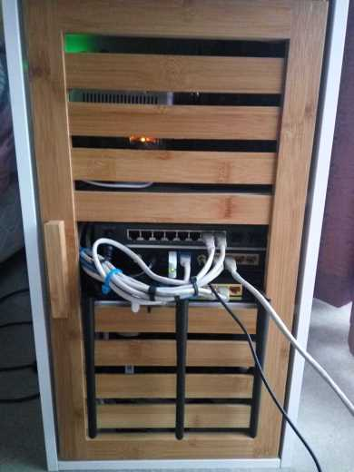
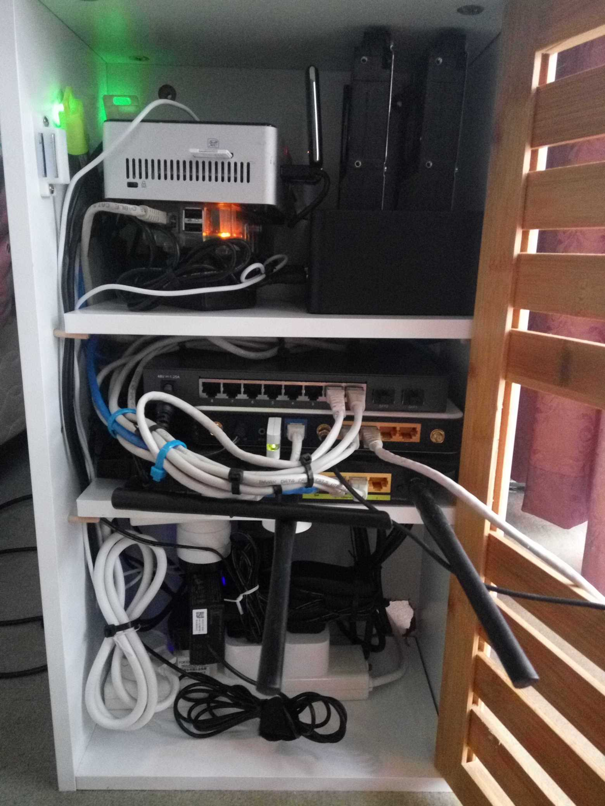
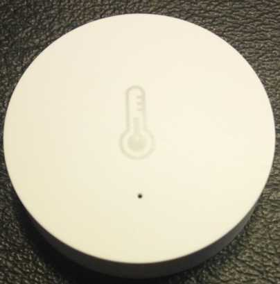
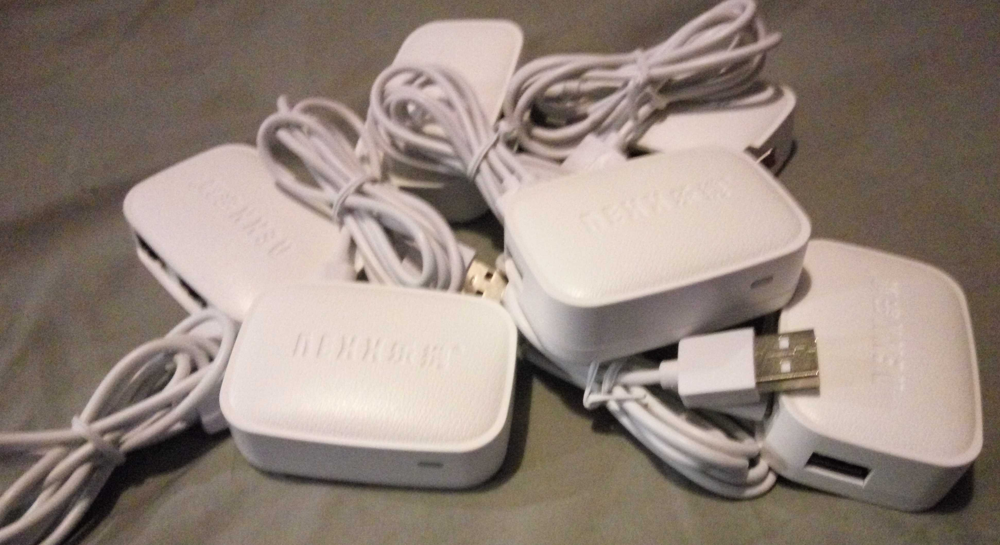
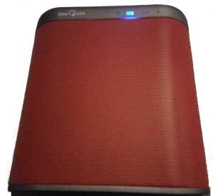

# Home Automation

## Introduction

Home Automation is an exciting new area of technology for anyone with an interest in integrating modern technology and scripting into our daily life. It allows interconnectivity between our audio, video, lighting, sensors, heating, cooling and security systems, working on an event and rule based system that allows us to customize very specific rules for our environment.

For anyone with scripting and automation background, Home Automation provides a way to outsource things we would typically manage manually to smart processes which are able to read and react to many dynamic values from dynamic sensors around our home.

For around $x, we have managed to turn our house into a Smart House, providing time saving and lifestyle improving routines to make our lives easier, increasing our security and safety, and

## System Architecture

The System Architecture for my Home Automation system comes down to a mix of networking, compute and storage resources used with excellent modern Home Automation (or IoT) devices. 

### Structure

Within the house, there are 3 locations where the equipment used to support the HA environment are hosted. These are in hidden/out of sight locations in 3 areas of the house known as the North, Central and South zones. It is important to distribute the equipment into these different zones as much of the solution relies on wireless technologies including WiFi and Zigbee. Each of the individual zones will provide POE, Wifi with a uniform set of SSIDs across the house and Zigbee.

In each location, there are 3 components. The first is one or more switches, connected to each of the other zones by LACP bundled ethernet interfaces. The second is a small server such as an Intel NUC i5 for Proxmox. The third is a set of disks connected to the server which are used for Ceph storage.

The following image shows the South zone cabinet both closed and open, with the contents of the cabinet. Inside, you will see a number of switches, an Intel NUC (for Proxmox), a Disk Cabinet with a pair of hard disks, a Raspberry Pi and all of the cabling required to connect and power the devices.

   
   <i>The South Cabinet</i>

Here, you can see the North zone cabinet under construction. Power Strips have been locked in to place using epoxy resin, 

### Security

Security is an important subject when considering Home Automation. Many of our Home Automation components (including Yeelight, Xiaomi Gateway) by default connect to the Internet to allow remote control of the devices. 

Insecure IoT devices introduce a large security risk to your home. Not only can these devices be hijacked by attackers to launch attacks against other targets, an attacker with access to your network can compromise your safety, security and privacy. To ensure that your IoT devices are protected, the following security steps can provide isolation:

- Place IoT devices in a dedicated IoT VLAN.
- Block all Internet connectivity for these devices.
- Temporarily provide access to individual devices when they are first added (to allow updates/onboarding).
- Enable local API access to IoT equipment where possible.
- Remove Internet access to devices which do not require this access.
- Drill-down further into the communications between equipment and "cloud services" and limit it accordingly.

## Components

### Network Switching and Routing

Our Home Automation switching and routing platform provides a network backbone of up to 4Gbps, though the use of Link Aggregation on TP-Link Gigabit POE switches. These form the core distribution network throughout the house, with 2 ports aggregated together in each direction, carrying all of the VLANs throughout the house.

Each of the backbone switches are connected to one TP-Link Archer C7 Gigabit Wifi router. These routers offer an additional 4 ports, 1 of which is reserved for WAN connectivity, and another reserved to connect to a TP-Link TL-MR3020 or TL-WR1043ND which were previously used as Wifi routers, but have been converted into "smart switches" capable of offloading some of the network services such as DNS and DHCP.

All of the switches + routers outside of the backbone POE routers are running <a href="openwrt-rtr.html">OpenWRT</a>. The previous link goes into some detail about how network redundancy and WAN connectivity is achieved, using dynamic routing and VRRP.

Unique to this environment are two particular features:
- Decentralised Routing - Every <a href="openwrt-rtr.html">OpenWRT</a> router is an independent router with a full routing table synchronised via OSPF, 
- Static DHCP - We use DHCP for auto-configuration of device configuration, however almost all DHCP allocations are performed from static allocations. There are small (4-5 IP) allocations per VLAN for each router, however these are intended for detecting the MAC addresses of new devices, which are then added as a static lease.

Using the OpenWRT configuration tool linked in my GitHub repo, we are generating the leases from CSV files which also serve as our IPAM system. 

### Virtualization Platform

For virtualization of systems and services at home, I have deployed the [Proxmox VE](https://www.proxmox.com) environment. Proxmox VE provides KVM-based virtualization and LXC-based Linux Containers

For a NUC machine, we have 3 types of storage - a 2.5 inch slot yupically, as well as flash storage for ISO images, backups and template files. 

### Distributed Storage

Distributed Storage is provided through Ceph 

### Home Automation Components

#### Cameras

Cameras are important for surveillance and motion detection. Using indoor and outdoor cameras managed by Zoneminder, we are able to monitor the property remotely and detect motion events. In the event of an attempted break-in, our door and window sensors will detect the attempted access, and are then able to trigger recording across all zones in Zoneminder.

Our camera security set-up consists of 6 outdoor cameras (at a cost of $313) and 4 indoor cameras (at a cost of $185). All of the cameras are ESCAM cameras, chosen due to their compatibility with ONVIF and POE. This means that all of the cameras can be powered by UPS protected POE switches, and monitored via standardised ONVIF-compatible tools.

HomeAssistant integrates with Zoneminder by providing a 

#### Lighting

For indoor LED lighting, I am using Xiaomi Yeelight RGB bulbs. Yeelights use WiFi for communication, which has a slightly higher level of complexity and power utilization than a hub based solution such as the Philips Hue system, but provides a high level of independence to avoid situations where lighting is impacted by a single hub failure (leveraging the inherent WiFi redundancy that was established in the earlier design) and requires less investment in centralised hub infrastructure.

Throughout the house, we are using 17 Yeelights. These are controlled by HomeAssistant, and grouped together into location-based groups. In HomeAssistant, we can assign time and motion based automations to turn on or off the lights as necessary.

#### Temperature and Humidity Sensors

For measuring Temperature and Humidity, I have 5 Xiaomi sensors (AU$75) which provide real-time feedback through the Xiaomi Home Hub over the Zigbee wireless protocol. 3 of those sensors are located within the 3 network equipment locations in the house (North, Central, South) and assist in monitoring the equipment to ensure it is not overheating.

  
   <i>The Xiaomi Temperature and Humidity Sensor</i>

The remaining two Temperature and Humidity sensors are wall-mounted indoors, at either side of the house. These are used to monitor the indoor temperature to determine when to activate Air Conditioning or Heating, and can also aid in understanding whether to activate lights or to sound warnings.

#### Humam Body Sensor

The Xiaomi Human Body Sensor provides a PIR sensor

#### Door and Window Sensor

Xiaomi Door and Window Sensors can be placed at the edge of window, door and drawer openings to detect when a door, window or drawer is opened. These sensors are extremely important for Security functionality, in that they can detect intrusions and door opening states regardless of the state of other sensors.

This is a layered security approach, where failure of other sensor mechanisms are accommodated for with immediate alarms triggered on opening of doors in secured areas of the property.

#### Wireless Switches

Xiaomi Wireless Switches are small battery powered zigbee devices, which can be mounted on walls, tables, or even carried around. During tests, button presses were picked up from several rooms away without issues. The switches are capable of three different events - Click, Double Click and Long Click.

These buttons are used for a number of different purposes. Due to the use of Yeelight 

### Whole-house Audio

In order to provide whole-house audio, I picked up 6 NEXX WT3050 devices (for $173) which provide 2 x 100Mbps ethernet ports, 1 USB port and 54Mbps WiFi. The NEXX devices are able to run OpenWRT, which provides great flexibility in configuring audio platforms.

The OpenWrt distribution used is an unmodified OpenWrt Chaos Calmer installation, with <a href="openwrt-wha.html">a number of packages</a> installed. The NEXX is a MediaTek-based SOC, with 8MB of Flash and 64MB of RAM.

  
   <i>The 6 NEXX WT3050 devices used to provide whole-house audio</i>

 For $29.75, I picked up 6 sets of USB A to DC jack connectors, as well as 6 sets of DC jack to USB micro connectors, and 6 USB audio sound card devices. These are coupled with 6 passive PoE injectors (for $20.80), to allow the NEXX devices to be powered via Ethernet cables.

To connect the USB audio devices to the NEXX devices, I purchased 6 rotatable 3-port USB hubs, at a cost of $23.67. These USB hubs allow multiple devices to be connected to each of the NEXX devices, in a small form factor, providing connectivity for multiple USB sound cards, as well as the ability to chain multiple NEXX devices together to save on switch ports.

#### Daisy Chaining

The NEXX WT3050 devices have a USB port and two ethernet ports. This in effect allows daisy-chaining the NEXX devices through the house for whole-house audio, but with some limitations. The NEXX can support up to 1.2a at 5V (in fact, this is closer to 1.7a in practice) and consumes between 180mA during boot, to 130mA during standard operation.

We use two separate strings of 3 NEXX devices in series to provide the 6 zones of whole-house audio. I tested with a number of NEXX units in series and found that after 3 devices, the behaviour of the 4th device becomes unstable due to voltage drop. With 3 devices, even with USB DAC devices attached, I was able to get stable, full functionality.

THe following image shows the configuration of the 6 NEXX devices, 4 of which are coupled to input POE synthesizers and output POE injectors, and the last two having free ethernet ports.

In this image, the two sets of whole-house audio POE strings are connected to power sources and networked together.

#### Portable Speakers

Sometimes, fixed whole-house audio doesn't quite meet the requirement, and for this I purchased 3 IdeaUSA W205 portable WiFi speakers, which cost $230 in total. The speakers connect via WiFi to our wireless network, and are able to stream audio on multiple protocols including Airplay.

  
   <i>The portable ideaUSA W205 WiFi speakers, providing WiFi, Bluetooth and AUX Audio</i>

#### Streaming Video

To provide video throughout the house, I have used 2 Beelink MINI MXIII II Android TV boxes, based on the Amlogic S905X Quad Core chipset, for a total of $126. The devices provide a pre-installed Kodi 16 installation for video streaming.

Kodi can be connected to HomeAssistant, to allow Kodi TV states to be used in automation recipes. An example of an automation based on Kodi states would be to automatically dim lights and change the volume of whole-house audio speakers during TV streaming.

For viewing Netflix, I use PlayOn, a streaming video transcoder. Netflix is notoriously difficult as it requires certain Operating Systems 

### Remote Management

All of these tools and features are useful, but when you are away from home, it is not possible to 
