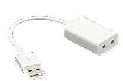

# OpenWRT Whole House Audio configuration

## Introduction

In order to provide whole-house audio, we need to install audio packages onto the OpenWRT mini-router devices to provide network streaming of audio. 

I found a lot of information on audio streaming online, however none of the solutions offered met the requirement that I have - namely to use the network throughout the house as an audio delivery channel to provide both multiple inputs and multiple outputs. Other examples show how to integrate in an MP3 player or similar, but none show how to create a full whole-house audio fabric.

To do this, there will be three distinct components:

- The audio receivers, which listen for TCP or Multicast RTP signals and play these signals via the attached speakers.
- The audio transmitters, which take signals from various devices and transmit the audio to the central broadcast server.
- The central broadcast server, which maintains a single stream of multicast RTP audio to all connected receivers.

### Network Utilization

Be aware that the method proposed in this document will result in a permanent 44100KHz uncompressed rtp stream multicast across the network. Even during times where the audio inputs are not transmitting anything, the stream will continue to be broadcast and the individual sound devices will continue to be active.

This can cause significant issues for networks where Wireless clients are connected. In this configuration, we have used an isolated VLAN for wired-only entertainment devices and PCs, on which the receivers and central broadcast server sit. If wireless clients are connected to this network, they will receive a stream of rtp data at a rate of 174kbps each, causing unnecessary load.

It is absolutely possible to instead create a set of unicast output sinks, and combine them together into a combined sink, which would remove the multicast stream from the network. The downside of such a model is that it would involve the trunking of several times the amount of audio, unless all of the units were connected to the same switch. I would note if you are embarking on this form of combined streaming that <a href="http://www.almost-working.com/multiroom-synced-audio-using-openwrt-and-pulseaudio/">some sources</a> report the combining of unicast sinks to be unstable and prone to latency issues.

### Diagram


### PulseAudio Configuration

If you're new to pulse, which I am, you might find the format of the configuration confusing. Initially, I was configuring the default.pa file on the OpenWRT routers and finding that it did not result in the expected audio output. On the Central Broadcast server side, it did. Why?

There are multiple ways to engage pulse. On OpenWRT, it will start pulse using an init script, and will pass the --system parameter to PulseAudio. This means that one pulse process will run for the entire system. On a graphical Debian or Ubuntu system, 

- Configuration for the OpenWRT pulseaudio receiver devices should be performed in the system.pa file. It is advisable to remove all of the default system.pa configuration and only use the configuration lines below, as the additional modules and 

- Configuration for the Central Broadcast server should be performed using the default.pa file. Avoid removing lines not mentioned in the configuration section of this walkthrough, as we want to maintain as much functionality as possible on this system.

## Receivers

### Packages

- Device Modules
   - kmod-usb-audio
   - kmod-sound-core
   - usbutils

- Audio Streaming
   - alsa-utils
   - pulseaudio-daemon

### Configuration

We configure pulseaudio on the OpenWRT routers to listen to Unicast TCP and Multicast UDP RDP streams from the network. This configuration will initialize the first hardware device detected by ALSA, listen for RTP audio and output it to this device.

The purpose of the combine sink is to allow for anywhere from one to many audio devices connected to the system to be combined as a single output device to aggregate all of the connected speakers. To see which devices have been detected on your OpenWRT system, use the following command:

```cat /proc/asound/devices```

You will see output similar to the following. In this case I have connected two separate USB sound cards to the one system, so we would have a hw:0 and a hw:1 device available within pulseaudio. As long as both devices are initialized in the pulseaudio configuration using the module-alsa-sink load-module command, audio output will automatically output from both sound card devices.

```
root@nexx:/etc/pulse# cat /proc/asound/devices
  0: [ 0]   : control
 16: [ 0- 0]: digital audio playback
 24: [ 0- 0]: digital audio capture
 32: [ 1]   : control
 33:        : timer
 48: [ 1- 0]: digital audio playback
 56: [ 1- 0]: digital audio capture
```

#### Audio Devices

A short discussion about audio devices before we continue on to the receiver configuration topic. For this setup, we've trialled a number of cheaper USB audio devices. Whilst I would love to have expensive USB DAC devices throughout the house, they are both expensive and require external power, which makes them inappropriate for this use. A key requirement of the DAC is that it must be USB bus powered, to take advantage of the POE power delivery method we use. This limits us to the lower end of DAC devices.

The first devices that I ordered for testing of the whole house audio setup were a well-known generic brand of USB SoundCard known as the Generalplus Technology Inc 7.1ch USB SoundCard, with a USB ID of 1B3F:2008. I did not find a large amount of information about these cards, which is surprising as they are very widespread.


These are USB soundcards with 2 x Stereo Output, 2 x Mono MIC input, USB2 bus support and entirely USB bus powered. Despite having 2 x Stereo output channels and 2 x Mono input channels, these inputs and outputs cannot be addressed separately and do not appear as different interfaces.

I can say that my experience with these devices was rather poor. From reading online, I noted that Generalplus develop a number of USB devices which are of a very similar nature and quality. The other two commonly seen Generalplus USB audio devices are these:

 

Audio from these devices is quite flat. The quality is suitable for some areas of a house, but overall was quite unimpressive. Adding to this a poor build quality, and I could not recommend this particular model. Even if you are going to purchase a cheap USB audio device, I would avoid this one, I have found the build quality of the "3D Audio" USB devices - which are cheaper - to be better. In addition, the multiple "channels" on this card do not exist, each input and output is not individually addressible, so you end up with a set of large USB audio devices with no appreciable features.


<br /><i>Build quality issues with the devices I received</i>

Unfortunately, 3 of the 6 devices that I purchased off of AliExpress for $17 to be used for audio testing were DOA - two of them visibly damaged in transit, and the third unable to hold a stereo output signal (got alternating mono depending on if it was half or fully plugged in). After hearing the audio quality, this was not of great concern.

#### PulseAudio Receiver Configuration

The following configuration would initialize one ALSA sink device (one USB sound card) and recieve audio via any RTP stream, TCP pulseaudio or tcp esound connection. It would combine any of the sink devices listed and use this combined output for audio.

/etc/pulse/system.pa:
```
load-module module-alsa-sink device=hw:0
load-module module-rtp-recv
load-module module-native-protocol-tcp auth-anonymous=1
load-module module-esound-protocol-tcp auth-anonymous=1
load-module module-combine-sink sink_name=combined
set-default-sink combined
```

Stepping through this configuration in detail:

- Line #1 initializes one ALSA sound device. If this is a multi-soundcard deployment, this will only initialize the first sound device. You would need to repeat this configuration for each additional sound device. Some sound devices may have multiple outputs such as a coaxial or optical output, in which case you can specify the particular output you would like to initialize using the [device],[output] specification, such as hw:0,1.

- Line #2 will initialize RTP streaming functionality. This is the configuration which allows streaming Multicast or Unicast RTP to be streamed out of the speakers of all listening pulseaudio clients. It is possible to specify a particular Multicast address to bind to, however we do not modify the defaults.

- Line #3 will enable the native pulseaudio TCP protocol. This allows zoning of audio by providing a way to stream audio to one particular unicast client. This also allows control of the volume of the zone from the Central Broadcast Server. We specify anonymous auth for this as we are providing IP level security for this implementation, however you may omit this, and use the built-in cookie authentication mechanism within pulseaudio for greater security. In practice, given we are allowing anonymous multicast RTP audio regardless of this setting, it is probably best to invest the time in universal IP-level security.

- Line #4 will additionally enable the esound protocol. 

- Line #5 will create the combined output sink, which by default will combine all connected/initialized output sink devices. This is exactly what we want, and saves 

- Line #6 sets the combined audio output sink as the default output sink, ensuring that all audio streamed to the devices will play out of the combined audio sink device, and 

If for some reason (I have not found a reason to do this, yet) we wanted to combine only some sources using the combined output sink, it is possible to do. I include this here only as a reference, this may come in handy in the event that a Raspberry Pi client is introduced and we want to avoid using the onboard audio device.

The following example shows how to initialize three ALSA audio devices, give each a convenient name, and then specify the specific slaves that are to be combined using the combined sink.

/etc/pulse/system.pa:
```
load-module module-alsa-sink device=hw:0 name=alsa0
load-module module-alsa-sink device=hw:1 name=alsa1
load-module module-alsa-sink device=hw:2 name=alsa2
load-module module-rtp-recv
load-module module-native-protocol-tcp auth-anonymous=1
load-module module-esound-protocol-tcp auth-anonymous=1
load-module module-combine-sink sink_name=combined slaves="alsa1,alsa2"
set-default-sink combined
```

In addition to the above configuration, the following settings should be set in the /etc/pulse/daemon.conf file. Without these settings, the low powered MIPS devices we use will go to 100% CPU trying to resample audio using floating point math not able to be offloaded to an optimized floating point unit by the processor.

```
exit-idle-time = -1
resample-method = trivial
flat-volumes = no
```

- exit-idle-time avoids the PulseAudio daemon terminating due to inactivity.

- resample-method ensures that we do not use floating point math to resample audio, which would send the CPU rocketing.

- flat-volumes allows the loudest application to set the system volume. This is disabled so that a misbehaving application on the Central Broadcast Server doesn't blow speakers or eardrums!

#### Per-Zone Volume/Mute Control

Once you have the setup above, you can control the volume of the individual sound card devices or the combined mixer device using the graphical pavucontrol utility. Note that when adjusting the combined mixer device volume, the volume of each individual sound card will be in proportion to their individual volume settings.

```PULSE_SERVER=192.168.29.134 pavucontrol```

This is helpful when sitting in front of a graphical console, but is not so helpful when automating or centralising the control of your Whole House Audio deployment. 

The following commands will toggle the mute setting of any one audio device. The Sink ID (eg 0, 1, 2) aligns with the sink configured, with the last sink ID always being the combined audio sink, and the first IDs being the individual sound card devices.

```
PULSE_SERVER=192.168.29.134 pactl set-sink-mute 2 toggle
PULSE_SERVER=192.168.29.134 pactl set-sink-mute 2 on
PULSE_SERVER=192.168.29.134 pactl set-sink-mute 2 off
```

Similarly, volumes can be set per Sink ID using a percentage value from 0% - 153%, however audio over 100% will be subject to distortion and clipping. The value 65535 is equivalent to 100% and can be used in its place. 

```
PULSE_SERVER=192.168.29.134 pactl set-sink-volume 2 100%
PULSE_SERVER=192.168.29.134 pactl set-sink-volume 2 65535
```

Individual direct output sinks can be created on the Central Broadcast server

pacmd load-module module-tunnel-sink server=192.168.1.1

## Feed-in Inputs/Transmitters

Becuase of the use of pulseaudio as the transmission layer, with MPD managing audio sources, we have a large amount of flexibility in accepting audio inputs for transmission. The three ways in which we can

- Audio can be sent to pulseaudio directly using what?

- Audio can be sent to MPD through MPD compatible clients such as:
   - Ampache
   - mpc
   - M.A.L.P, an Android MPD client
   - impdclient, an iPhone MPD client

## Central Broadcast Server

A central broadcast server can be hosted on any number of platforms (including but not limited to VM, Raspberry Pi or even potentially but not advisably an OpenWRT router.

For this deployment, we are using a Debian 8 

### MPD and PulseAudio Configuration

In /etc/mpd.conf, disable the default audio_output setting for 

```
audio_output {
        type            "pulse"
        name            "MPD RTP"
        sink            "rtp"
        mixer_type      "software"
}
```

In /etc/pulse/default.pa

```
load-module module-zeroconf-publish

load-module module-null-sink sink_name=rtp format=s16be channels=2 rate=44100 sink_properties="device.description='RTP Multicast Sink'"
load-module module-rtp-send source=rtp.monitor
```

Because PulseAudio is running in per-user mode, at this point you will need to kill the pulseaudio daemon running for the current user, to allow these settings to take effect. You can do this with:

```pulseaudio -k```

In most cases, it will respawn. If not, you can start it manually with:

```pulseaudio --start```

### Ampache

On your mariadb server, create the ampache database, which is necessary for installation:

mysql -e "CREATE DATABASE ampache"
mysql -e "GRANT ALL ON ampache.* to 'ampache'@'192.168.28.12' IDENTIFIED BY 'password'"

Install Ampache with the following command:

```apt-get install ampache mysql-client```

Populate the ampache database, and default ampache configuration:

```
cat /usr/share/ampache/www/sql/ampache.sql | mysql -h 192.168.24.10 -u ampache -p ampache
cp /usr/share/ampache/www/config/ampache.cfg.php.dist /etc/ampache/ampache.cfg.php
```

Edit ampache.cfg.php and set the following variables, ensuring they are appropriate to your installation:

```
web_path        = "/ampache"
database_hostname = 192.168.24.10
database_name = ampache
database_username = ampache
database_password = password
use_auth        = "false"
```

Navigate to the ampache page: http://127.0.0.1/ampache

- Add a user account with the admin privilege level, which can be used to log in to ampache.

- Edit the configuration file and re-enable authentication.
