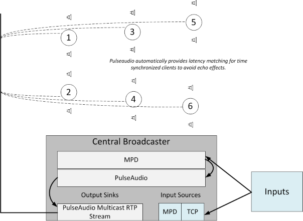

# OpenWRT Whole House Audio configuration

## Introduction

In order to provide whole-house audio, we need to install audio packages onto the OpenWRT mini-router devices to provide network streaming of audio. 

I found a lot of information on audio streaming online, however none of the solutions offered met the requirement that I have - namely to use the network throughout the house as an audio delivery channel to provide both multiple inputs and multiple outputs. Other examples show how to integrate in an MP3 player or similar, but none show how to create an audio fabric.

To do this, there will be three distinct components:

- The audio receivers, which listen for TCP or Multicast RTP signals and play these signals via the attached speakers.
- The audio transmitters, which take signals from various devices and transmit the audio to the central broadcast server.
- The central broadcast server, which maintains a single stream of multicast RTP audio to all connected receivers.

### Network Utilization

Be aware that the method proposed in this document will result in a permanent 44100KHz uncompressed rtp stream multicast across the network. Even during times where the audio inputs are 

This can cause significant issues for networks where Wireless clients are connected. In this configuration, we have used an isolated VLAN for wired-only entertainment devices and PCs, on which the receivers and central broadcast server sit.

### Diagram



## Receivers

### Packages

- Device Modules
   - kmod-usb-audio
   - kmod-sound-core
   - usbutils

- Audio Streaming
   - alsa-utils
   - pulseaudio-daemon

### Configuration

We configure pulseaudio on the OpenWRT routers to listen to Unicast TCP and Multicast UDP RDP streams from the network. This configuration will initialize the first hardware device detected by ALSA, 

The purpose of the combine sink is to allow for anywhere from one to many audio devices connected to the system to be combined as a single output device to aggregate all of the connected speakers. To see which devices have been detected on your OpenWRT system, use the following command:

```cat /proc/asound/devices```

You will see output similar to the following. In this case I have connected two separate USB sound cards to the one system, so we would have a hw:0 and a hw:1 device available within pulseaudio. As long as both devices are initialized in the pulseaudio configuration using the module-alsa-sink load-module command, audio output will automatically output from both sound card devices.

```
root@nexx:/etc/pulse# cat /proc/asound/devices
  0: [ 0]   : control
 16: [ 0- 0]: digital audio playback
 24: [ 0- 0]: digital audio capture
 32: [ 1]   : control
 33:        : timer
 48: [ 1- 0]: digital audio playback
 56: [ 1- 0]: digital audio capture
```

#### PulseAudio Receiver Configuration

The following configuration would initialize one ALSA sink device (one USB sound card) and recieve 

/etc/pulse/system.pa:
```
load-module module-alsa-sink device=hw:0
load-module module-rtp-recv
load-module module-native-protocol-tcp auth-anonymous=1
load-module module-esound-protocol-tcp auth-anonymous=1
load-module module-combine-sink sink_name=combined
set-default-sink combined
```

Stepping through this configuration in detail:

- Line #1 initializes one ALSA sound device. If this is a multi-soundcard deployment, this will only initialize the first sound device. You would need to repeat this configuration for each additional sound device. Some sound devices may have multiple outputs such as a coaxial or optical output, in which case you can specify the particular output you would like to initialize using the [device],[output] specification, such as hw:0,1.

- Line #2 will initialize RTP streaming functionality. This is the configuration which allows streaming Multicast or Unicast RTP to be streamed out of the speakers of all listening pulseaudio clients. It is possible to specify a particular Multicast address to bind to, however we do not modify the defaults.

- Line #3 will enable the native pulseaudio TCP protocol. This allows zoning of audio by providing a way to stream audio to one particular unicast client. This also allows control of the volume of the zone from the Central Broadcast Server. We specify anonymous auth for this as we are providing IP level security for this implementation, however you may omit this, and use the built-in cookie authentication mechanism within pulseaudio for greater security. In practice, given we are allowing anonymous multicast RTP audio regardless of this setting, it is probably best to invest the time in universal IP-level security.

- Line #4 will additionally enable the esound protocol. 

- Line #5 will create the combined output sink, which by default will combine all connected/initialized output sink devices. This is exactly what we want, and saves 

- Line #6 sets the combined audio output sink as the default output sink, ensuring that all audio streamed to the devices will play out of the combined audio sink device, and 

If for some reason (I have not found a reason to do this, yet) we wanted to combine only some sources using the combined output sink, it is possible to do. I include this here only as a reference, this may come in handy in the event that a Raspberry Pi client is introduced and we want to avoid using the onboard audio device.

The following example shows how to initialize three ALSA audio devices, give each a convenient name, and then specify the specific slaves that are to be combined using the combined sink.

/etc/pulse/system.pa:
```
load-module module-alsa-sink device=hw:0 name=alsa0
load-module module-alsa-sink device=hw:1 name=alsa1
load-module module-alsa-sink device=hw:2 name=alsa2
load-module module-rtp-recv
load-module module-native-protocol-tcp auth-anonymous=1
load-module module-esound-protocol-tcp auth-anonymous=1
load-module module-combine-sink sink_name=combined slaves="alsa1,alsa2"
set-default-sink combined
```

#### Per-Zone Volume/Mute Control

Once you have the setup above, you can control the volume of the individual sound card devices or the combined mixer device using the graphical pavucontrol utility. Note that when adjusting the combined mixer device volume, the volume of each individual sound card will be in proportion to their 

```PULSE_SERVER=192.168.29.134 pavucontrol```

This is helpful when sitting in front of a graphical console, but is not so helpful when automating or centralising the control of your Whole House Audio deployment. 

```
PULSE_SERVER=192.168.29.134 pactl set-sink-mute 2 toggle
PULSE_SERVER=192.168.29.134 pactl set-sink-mute 2 on
PULSE_SERVER=192.168.29.134 pactl set-sink-mute 2 off
```

Individual direct output sinks can be created on the Central Broadcast server

pacmd load-module module-tunnel-sink server=192.168.1.1

## Feed-in Inputs/Transmitters

Becuase of the use of pulseaudio as the transmission layer, with MPD managing audio sources, we have a large amount of flexibility in 

## Central Broadcast Server

A central broadcast server can be hosted on any number of platforms (including but not limited to VM, Raspberry Pi or even potentially but not advisably an OpenWRT router.

For this deployment, we are using a Debian 8 
